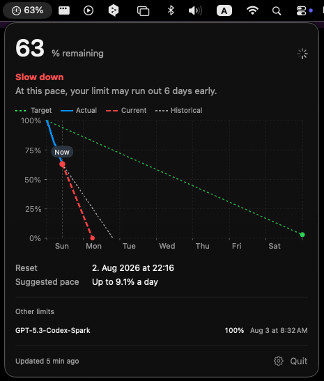

<h1 align="center">Codex Limits</h1>

<p align="center">
  <strong>Know whether your Codex limit will last until reset.</strong>
</p>

<p align="center">
  A macOS menu-bar app that tracks your Codex limit and recommends an hourly or daily pace.
</p>

<p align="center">
  <a href="https://github.com/thrr87/codex-limits/actions/workflows/ci.yml"></a>
  
  
  <a href="LICENSE"></a>
</p>

<p align="center">
  
</p>

> [!NOTE]
> Codex Limits is an independent, unofficial project. It is not affiliated with or endorsed by OpenAI.

## What it tells you

Codex shows how much usage remains. That number does not tell you whether it will last. Codex Limits compares your use with the time left before reset.

Open the menu to see:

- The percentage left, also shown in the menu bar.
- A status: `Slow down`, `On track`, or `Room to use more`.
- A suggested hourly or daily pace.
- Current and past use plotted against the target.

## How to read the chart

- **Target** runs from 100% to your chosen buffer at reset.
- **Actual** shows the samples recorded in the current window.
- **Current** projects your recent pace through the reset.
- **Historical** compares it with earlier use.

The default buffer is 3%. You can change it in Settings.

## Features

- Shows the main Codex limit and model-specific limits.
- Saves usage samples for the current window.
- Estimates the percentage left at reset from current and past use.
- Keeps up to 90 days of history in versioned daily JSON files.
- Can copy history to a private folder that you choose.
- Refreshes on launch, after wake, when you open the menu, every ten minutes, or on request.
- Runs as a native SwiftUI menu-bar app with no third-party runtime dependencies.

## How it works

1. Codex Limits starts your installed Codex CLI and reads usage through its local app server.
2. It saves percentage samples on your Mac. Daily token history supplies data for the first forecast.
3. It compares actual and projected use with a target that ends at your chosen buffer.
4. It shows a status and suggests how much you can use per hour or day.

Forecasts improve as the app records more samples. They are estimates, not guarantees.

## Privacy

Codex Limits keeps usage data on your Mac:

- It does not copy or store your Codex credentials.
- It sends no telemetry or analytics. It has no notifications or direct network client.
- It stores main-limit samples in the app's Application Support directory.
- If you enable history sync, it copies only usage samples to the selected folder. Preferences, credentials, and raw Codex responses stay on your Mac.
- Synced JSON files contain observation times, remaining percentages, and reset times. Choose a folder that you do not share with other people.
- The Codex CLI may contact the Codex service as part of its normal operation.

Do not attach raw CLI output or screenshots containing account usage to public issues.

## Requirements

- macOS 14 or later
- Xcode 16.4 or later
- A signed-in, Homebrew-managed Codex CLI at `/opt/homebrew/bin/codex` or `/usr/local/bin/codex`

Codex Limits does not use a Codex binary bundled with another app. Install and update the standalone CLI yourself.

## Build from source

Clone the repository and run:

```sh
Scripts/build-app.sh
```

The script creates an ad-hoc signed app at `.build/release/Codex Limits.app`. Launch it with:

```sh
open ".build/release/Codex Limits.app"
```

The project does not provide a prebuilt or notarized app. Open `Package.swift` in Xcode to work on the source.

## Test

```sh
swift test
```

The tests use synthetic usage data. Do not commit exported account data or local app state as fixtures.

## Current limitations

- You must build the app from source.
- The forecast needs local samples to improve.
- Codex CLI responses may change between versions. If parsing fails, update the CLI before reporting a problem.

## Security

Report vulnerabilities privately. See [SECURITY.md](.github/SECURITY.md) for instructions.

## License

MIT. See [LICENSE](LICENSE).
