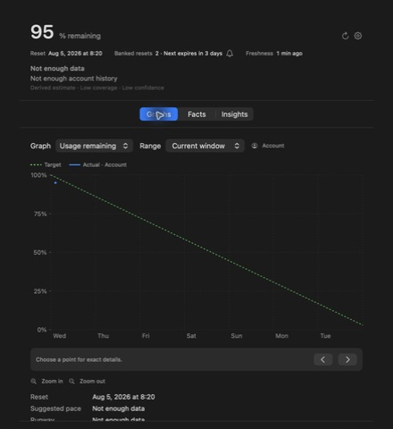
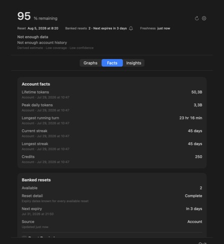
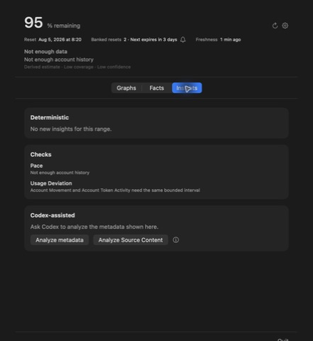

<h1 align="center">Codex Limits</h1>

<p align="center">
  <strong>See whether your Codex usage will last until reset and which local Tasks this Mac observed.</strong>
</p>

<p align="center">
  A macOS menu bar app for Codex usage, Tasks, agents, resets, and pace.
</p>

<p align="center">
  <a href="https://github.com/thrr87/codex-limits/actions/workflows/ci.yml"></a>
  
  
  <a href="LICENSE"></a>
</p>

<p align="center">
  
</p>

> [!NOTE]
> Codex Limits is an independent, unofficial project. OpenAI does not make or endorse it.

## What it shows

Codex shows Usage remaining. Codex Limits shows when it resets, how it changed, and which local Tasks this Mac observed.

Open the menu to see:

- Weekly Usage remaining, the reset time, and banked resets.
- Runway and a suggested pace when the data supports an estimate.
- Account and local token activity.
- Active time, concurrency, and Usage Receipts for the Task Trees this Mac can read.
- Checks that run on this Mac and an optional `Analyze with Codex` action.

Switch among three views:

- **Graphs** — Usage remaining, Token activity, Usage per token, and Concurrency.
- **Facts** — account facts, banked resets, Other limits, Active Time, and Usage Receipts.
- **Insights** — local checks, saved observations, and analysis you ask Codex to run.

<table>
  <tr>
    <td></td>
    <td></td>
  </tr>
  <tr>
    <td align="center"><strong>Facts</strong></td>
    <td align="center"><strong>Insights</strong></td>
  </tr>
</table>

## How to read the data

Codex Limits keeps three kinds of values separate:

- **Account facts** come from the Codex account API.
- **Local facts** come from Codex records on this Mac.
- **Derived estimates** name their Coverage and Confidence.

The app hides weak estimates and says what data is missing. It shows account and local token totals side by side when they differ.

## Features

- Uses the weekly Codex limit as the main Usage remaining value.
- Shows model-specific and shorter windows as Other limits.
- Records account usage history until you delete it.
- Shows the number of banked resets, known expiry times, and Reset Detail Coverage.
- Sends one local reminder before the next known banked-reset expiry. The default lead time is 24 hours.
- Shows local activity by Project, Task Tree, agent, model, reasoning level, and turn when the source has those facts.
- Compares periods only when it has sound start, end, and workload data. It does not claim a fixed token allowance.
- Runs local Insights on this Mac.
- Asks Codex to analyze selected data only after you click an analysis button.
- Lists the selected Source Content types—prompts, responses, code, paths, commands, and tool output—before you send them to Codex.
- Copies account usage samples to a private folder that you choose.
- Deletes all Codex Limits analytics history on this Mac and in the selected sync folder when you choose `Delete analytics history`.
- Refreshes on launch, after wake, when you open the menu, every ten minutes, or on request.
- Runs as a native SwiftUI menu-bar app with no third-party runtime dependencies.
- Does not redeem resets, change Codex settings, or control Tasks.

## How it works

1. Codex Limits starts your installed Codex CLI and reads account data through its local app server.
2. It reads local Codex records without taking control of a Task.
3. It stores small history files on your Mac and keeps each account separate.
4. It uses those sources to make charts, facts, and Insights.
5. It sends a request to Codex only when you choose an `Analyze with Codex` action.

Coverage says how much needed data the app saw. Confidence says how well that data supports an estimate. The app hides Low-confidence estimates.

## Privacy

Codex Limits keeps analytics local by default:

- It does not copy or store your Codex credentials.
- It sends no usage data to this project or its author.
- It stores account readings and local summaries in the app's Application Support directory.
- It does not copy prompts, responses, code, paths, commands, or tool output into Analytics History.
- Local Insights run on your Mac and consume no Codex allowance.
- `Analyze metadata` sends only the metadata shown in the app.
- `Analyze Source Content` shows each content type before you send it.
- Each request to Codex uses your Codex allowance. The buttons appear only when Codex offers the required model and reasoning level.
- Reset reminders use local macOS notifications. The app asks for permission when you first enable the reminder.
- If you enable history sync, it copies only usage samples to the selected folder. Preferences, credentials, and raw Codex responses stay on your Mac.
- Synced JSON files contain observation times, remaining percentages, and reset times. Choose a folder that you do not share with other people.
- `Delete analytics history` removes Codex Limits history on this Mac and in the selected sync folder. It keeps your preferences and source Codex records.
- The Codex CLI contacts the Codex service during normal account reads and user-requested Codex analysis.

Do not attach raw CLI output or screenshots containing account usage to public issues.

## Requirements

- macOS 14 or later
- Xcode 16.4 or later
- A signed-in, Homebrew-managed Codex CLI at `/opt/homebrew/bin/codex` or `/usr/local/bin/codex`

Codex Limits does not use a Codex binary bundled with another app. Install and update the standalone CLI yourself.

## Build from source

Clone the repository and run:

```sh
Scripts/build-app.sh
```

The script creates an ad-hoc signed app at `.build/release/Codex Limits.app`. Launch it with:

```sh
open ".build/release/Codex Limits.app"
```

This project offers no prebuilt or notarized app. Open `Package.swift` in Xcode to work on the source.

## Test

```sh
swift test
```

The tests use made-up usage data. Do not commit exported account data or local app state as test data.

## Current limitations

- You must build the app from source.
- Account and local values can differ because this Mac may not observe every Codex Task.
- Estimates need account readings near both ends of a time range and enough similar local work.
- `Analyze with Codex` appears only when Codex offers GPT-5.6 Luna with Medium reasoning.
- Codex CLI responses may change between versions. If parsing fails, update the CLI before reporting a problem.

## Security

Report vulnerabilities privately. See [SECURITY.md](.github/SECURITY.md) for instructions.

## License

MIT. See [LICENSE](LICENSE).
